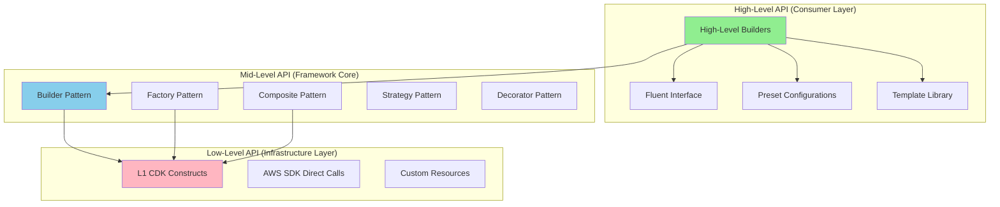

# 🏛️ Architecture & Design Patterns

## Framework Architecture Overview

### Three-Layer Architecture with Dual APIs



### Core Design Principles

1. **Separation of Concerns**: Each layer has distinct responsibilities
2. **Open/Closed Principle**: Open for extension, closed for modification
3. **Dependency Inversion**: Depend on abstractions, not concretions
4. **Interface Segregation**: Small, focused interfaces
5. **Single Responsibility**: Each class has one reason to change
6. **DRY (Don't Repeat Yourself)**: Shared logic in base classes/helpers

## Gang of Four (GOF) Design Patterns

### 1. Builder Pattern (Creational)

**Purpose**: Construct complex contact flows step-by-step with fluent interface.

**Implementation**:

```csharp
// Abstract builder interface
public interface IContactFlowBuilder
{
    IContactFlowBuilder SetName(string name);
    IContactFlowBuilder SetDescription(string description);
    IContactFlowBuilder SetType(ContactFlowType type);
    IContactFlowActionBuilder AddAction();
    ContactFlow Build();
}

// Concrete builder with fluent interface
public class ContactFlowBuilder : IContactFlowBuilder
{
    private readonly ContactFlow _flow;
    private readonly List<FlowAction> _actions;
    private FlowAction _currentAction;

    public ContactFlowBuilder()
    {
        _flow = new ContactFlow
        {
            Version = "2019-10-30",
            Actions = new List<FlowAction>(),
            Metadata = new FlowMetadata()
        };
        _actions = new List<FlowAction>();
    }

    public IContactFlowBuilder SetName(string name)
    {
        _flow.Name = name;
        return this;
    }

    public IContactFlowBuilder SetDescription(string description)
    {
        _flow.Description = description;
        return this;
    }

    public IContactFlowBuilder SetType(ContactFlowType type)
    {
        _flow.Type = type.ToString();
        return this;
    }

    public IContactFlowActionBuilder AddAction()
    {
        return new ContactFlowActionBuilder(this);
    }

    internal IContactFlowBuilder AppendAction(FlowAction action)
    {
        _actions.Add(action);
        _currentAction = action;
        return this;
    }

    public ContactFlow Build()
    {
        // Wire up transitions
        for (int i = 0; i < _actions.Count - 1; i++)
        {
            if (_actions[i].Transitions == null)
            {
                _actions[i].Transitions = new Transitions();
            }
            _actions[i].Transitions.NextAction = _actions[i + 1].Identifier;
        }

        _flow.Actions = _actions;
        _flow.StartAction = _actions.First().Identifier;

        // Validate before returning
        ValidateFlow(_flow);

        return _flow;
    }

    private void ValidateFlow(ContactFlow flow)
    {
        if (string.IsNullOrEmpty(flow.Name))
            throw new InvalidOperationException("Flow must have a name");
        
        if (flow.Actions.Count == 0)
            throw new InvalidOperationException("Flow must have at least one action");
        
        if (flow.Actions.Count > 250)
            throw new InvalidOperationException("Flow cannot exceed 250 actions");
    }
}

// Nested action builder
public class ContactFlowActionBuilder
{
    private readonly ContactFlowBuilder _flowBuilder;
    private FlowAction _action;

    internal ContactFlowActionBuilder(ContactFlowBuilder flowBuilder)
    {
        _flowBuilder = flowBuilder;
        _action = new FlowAction
        {
            Identifier = Guid.NewGuid().ToString()
        };
    }

    public IContactFlowActionBuilder OfType(ActionType type)
    {
        _action.Type = type.ToString();
        return this;
    }

    public IContactFlowActionBuilder WithParameters(Action<IParameterBuilder> configure)
    {
        var builder = new ParameterBuilder();
        configure(builder);
        _action.Parameters = builder.Build();
        return this;
    }

    public IContactFlowBuilder Then()
    {
        return _flowBuilder.AppendAction(_action);
    }
}

// Usage example
var flow = new ContactFlowBuilder()
    .SetName("Sales Inbound Flow")
    .SetDescription("Main sales contact flow")
    .SetType(ContactFlowType.ContactFlow)
    .AddAction()
        .OfType(ActionType.MessageParticipant)
        .WithParameters(p => p.SetText("Welcome to our sales team"))
        .Then()
    .AddAction()
        .OfType(ActionType.GetParticipantInput)
        .WithParameters(p => p
            .SetText("Press 1 for sales, 2 for support")
            .SetMaxDigits(1)
            .SetTimeout(5))
        .Then()
    .Build();
```

### 2. Factory Pattern (Creational)

**Purpose**: Create different types of actions/components without specifying their exact classes.

**Implementation**:

```csharp
// Abstract factory
public interface IFlowActionFactory
{
    IFlowAction CreateAction(ActionType type);
    IFlowAction CreateActionFromJson(string json);
}

// Concrete factory
public class StandardFlowActionFactory : IFlowActionFactory
{
    private readonly Dictionary<ActionType, Func<IFlowAction>> _creators;

    public StandardFlowActionFactory()
    {
        _creators = new Dictionary<ActionType, Func<IFlowAction>>
        {
            { ActionType.MessageParticipant, () => new MessageParticipantAction() },
            { ActionType.GetParticipantInput, () => new GetInputAction() },
            { ActionType.TransferToQueue, () => new TransferToQueueAction() },
            { ActionType.InvokeLambda, () => new InvokeLambdaAction() },
            { ActionType.CheckHours, () => new CheckHoursOfOperationAction() },
            { ActionType.SetAttributes, () => new SetAttributesAction() },
            { ActionType.Compare, () => new CompareAction() }
        };
    }

    public IFlowAction CreateAction(ActionType type)
    {
        if (!_creators.ContainsKey(type))
        {
            throw new ArgumentException($"Unknown action type: {type}");
        }

        return _creators[type]();
    }

    public IFlowAction CreateActionFromJson(string json)
    {
        var actionData = JsonSerializer.Deserialize<JsonElement>(json);
        var typeString = actionData.GetProperty("Type").GetString();
        var type = Enum.Parse<ActionType>(typeString);
        
        var action = CreateAction(type);
        action.Deserialize(actionData);
        
        return action;
    }
}

// Abstract factory for different flow types
public abstract class FlowFactory
{
    public abstract ContactFlow CreateFlow();
    protected abstract void ConfigureActions();
    protected abstract void ConfigureTransitions();
}

// Concrete factory for customer queue flows
public class CustomerQueueFlowFactory : FlowFactory
{
    private ContactFlow _flow;

    public override ContactFlow CreateFlow()
    {
        _flow = new ContactFlow
        {
            Type = "CUSTOMER_QUEUE",
            Version = "2019-10-30"
        };

        ConfigureActions();
        ConfigureTransitions();

        return _flow;
    }

    protected override void ConfigureActions()
    {
        _flow.Actions = new List<FlowAction>
        {
            new MessageParticipantAction
            {
                Identifier = "welcome",
                Parameters = new MessageParameters
                {
                    Text = "You are in the queue. An agent will be with you shortly."
                }
            },
            new LoopAction
            {
                Identifier = "queue-loop",
                Parameters = new LoopParameters
                {
                    LoopCount = 100
                }
            }
        };
    }

    protected override void ConfigureTransitions()
    {
        _flow.Actions[0].Transitions = new Transitions
        {
            NextAction = "queue-loop"
        };
    }
}
```

### 3. Strategy Pattern (Behavioral)

**Purpose**: Define family of algorithms (routing strategies, validation strategies) and make them interchangeable.

**Implementation**:

```csharp
// Strategy interface
public interface IRoutingStrategy
{
    string DetermineQueue(ContactAttributes attributes, List<QueueInfo> availableQueues);
    int CalculatePriority(ContactAttributes attributes);
}

// Skill-based routing strategy
public class SkillBasedRoutingStrategy : IRoutingStrategy
{
    public string DetermineQueue(ContactAttributes attributes, List<QueueInfo> availableQueues)
    {
        var requiredSkills = attributes.GetStringList("RequiredSkills");
        
        var matchingQueue = availableQueues
            .Where(q => q.Skills.Intersect(requiredSkills).Count() == requiredSkills.Count)
            .OrderBy(q => q.CurrentQueueSize)
            .FirstOrDefault();

        return matchingQueue?.Arn ?? availableQueues.First().Arn;
    }

    public int CalculatePriority(ContactAttributes attributes)
    {
        var skillLevel = attributes.GetInt("CustomerSkillLevel", 5);
        return Math.Max(1, 10 - skillLevel); // Higher skill = higher priority
    }
}

// VIP-based routing strategy
public class VipRoutingStrategy : IRoutingStrategy
{
    public string DetermineQueue(ContactAttributes attributes, List<QueueInfo> availableQueues)
    {
        var isVip = attributes.GetBool("IsVIP", false);
        
        if (isVip)
        {
            var vipQueue = availableQueues.FirstOrDefault(q => q.Name.Contains("VIP"));
            if (vipQueue != null)
                return vipQueue.Arn;
        }

        return availableQueues
            .OrderBy(q => q.CurrentQueueSize)
            .First().Arn;
    }

    public int CalculatePriority(ContactAttributes attributes)
    {
        return attributes.GetBool("IsVIP", false) ? 1 : 5;
    }
}

// Context that uses strategy
public class RoutingContext
{
    private IRoutingStrategy _strategy;

    public RoutingContext(IRoutingStrategy strategy)
    {
        _strategy = strategy;
    }

    public void SetStrategy(IRoutingStrategy strategy)
    {
        _strategy = strategy;
    }

    public RoutingDecision MakeRoutingDecision(
        ContactAttributes attributes, 
        List<QueueInfo> availableQueues)
    {
        var queueArn = _strategy.DetermineQueue(attributes, availableQueues);
        var priority = _strategy.CalculatePriority(attributes);

        return new RoutingDecision
        {
            TargetQueueArn = queueArn,
            Priority = priority,
            StrategyUsed = _strategy.GetType().Name
        };
    }
}

// Usage
var context = new RoutingContext(new SkillBasedRoutingStrategy());
var decision = context.MakeRoutingDecision(contactAttributes, queues);

// Switch strategy at runtime
context.SetStrategy(new VipRoutingStrategy());
var vipDecision = context.MakeRoutingDecision(contactAttributes, queues);
```

### 4. Decorator Pattern (Structural)

**Purpose**: Add responsibilities to contact flows dynamically (logging, validation, transformation).

**Implementation**:

```csharp
// Component interface
public interface IContactFlow
{
    string Name { get; }
    string Execute(ContactContext context);
    string ToJson();
}

// Concrete component
public class BaseContactFlow : IContactFlow
{
    public string Name { get; set; }
    public List<FlowAction> Actions { get; set; }

    public string Execute(ContactContext context)
    {
        // Execute flow logic
        return "Success";
    }

    public string ToJson()
    {
        return JsonSerializer.Serialize(this);
    }
}

// Abstract decorator
public abstract class ContactFlowDecorator : IContactFlow
{
    protected readonly IContactFlow _decoratedFlow;

    protected ContactFlowDecorator(IContactFlow flow)
    {
        _decoratedFlow = flow;
    }

    public virtual string Name => _decoratedFlow.Name;

    public virtual string Execute(ContactContext context)
    {
        return _decoratedFlow.Execute(context);
    }

    public virtual string ToJson()
    {
        return _decoratedFlow.ToJson();
    }
}

// Logging decorator
public class LoggingContactFlowDecorator : ContactFlowDecorator
{
    private readonly ILogger _logger;

    public LoggingContactFlowDecorator(IContactFlow flow, ILogger logger) 
        : base(flow)
    {
        _logger = logger;
    }

    public override string Execute(ContactContext context)
    {
        _logger.LogInformation($"Executing flow: {Name}");
        _logger.LogInformation($"Contact ID: {context.ContactId}");

        var stopwatch = Stopwatch.StartNew();
        
        try
        {
            var result = base.Execute(context);
            
            stopwatch.Stop();
            _logger.LogInformation($"Flow completed in {stopwatch.ElapsedMilliseconds}ms");
            
            return result;
        }
        catch (Exception ex)
        {
            stopwatch.Stop();
            _logger.LogError(ex, $"Flow execution failed after {stopwatch.ElapsedMilliseconds}ms");
            throw;
        }
    }
}

// Validation decorator
public class ValidationContactFlowDecorator : ContactFlowDecorator
{
    public ValidationContactFlowDecorator(IContactFlow flow) : base(flow) { }

    public override string Execute(ContactContext context)
    {
        ValidateContext(context);
        ValidateFlow();
        
        return base.Execute(context);
    }

    public override string ToJson()
    {
        var json = base.ToJson();
        ValidateJsonStructure(json);
        return json;
    }

    private void ValidateContext(ContactContext context)
    {
        if (string.IsNullOrEmpty(context.ContactId))
            throw new ValidationException("Contact ID is required");
    }

    private void ValidateFlow()
    {
        // Validate flow structure
        var flowData = JsonSerializer.Deserialize<ContactFlow>(_decoratedFlow.ToJson());
        
        if (flowData.Actions.Count > 250)
            throw new ValidationException("Flow exceeds maximum 250 actions");
        
        if (flowData.Actions.Count == 0)
            throw new ValidationException("Flow must have at least one action");
    }

    private void ValidateJsonStructure(string json)
    {
        try
        {
            JsonDocument.Parse(json);
        }
        catch (JsonException ex)
        {
            throw new ValidationException("Invalid JSON structure", ex);
        }
    }
}

// Caching decorator
public class CachingContactFlowDecorator : ContactFlowDecorator
{
    private readonly IMemoryCache _cache;
    private string _cachedJson;

    public CachingContactFlowDecorator(IContactFlow flow, IMemoryCache cache) 
        : base(flow)
    {
        _cache = cache;
    }

    public override string ToJson()
    {
        if (_cachedJson != null)
            return _cachedJson;

        var cacheKey = $"flow_json_{Name}";
        
        if (_cache.TryGetValue(cacheKey, out string cached))
        {
            return cached;
        }

        var json = base.ToJson();
        
        _cache.Set(cacheKey, json, TimeSpan.FromMinutes(10));
        _cachedJson = json;
        
        return json;
    }
}

// Usage - chain decorators
IContactFlow flow = new BaseContactFlow { Name = "Sales Flow" };
flow = new ValidationContactFlowDecorator(flow);
flow = new LoggingContactFlowDecorator(flow, logger);
flow = new CachingContactFlowDecorator(flow, memoryCache);

var result = flow.Execute(context);
```

### 5. Composite Pattern (Structural)

**Purpose**: Compose flows and flow modules into tree structures.

**Implementation**:

```csharp
// Component interface
public interface IFlowComponent
{
    string Identifier { get; set; }
    string Type { get; }
    void Add(IFlowComponent component);
    void Remove(IFlowComponent component);
    IFlowComponent GetChild(int index);
    string ToJson();
    void Execute(ContactContext context);
}

// Leaf - individual action
public class FlowAction : IFlowComponent
{
    public string Identifier { get; set; }
    public string Type { get; set; }
    public Dictionary<string, object> Parameters { get; set; }
    public Transitions Transitions { get; set; }

    public void Add(IFlowComponent component)
    {
        throw new NotSupportedException("Cannot add to leaf action");
    }

    public void Remove(IFlowComponent component)
    {
        throw new NotSupportedException("Cannot remove from leaf action");
    }

    public IFlowComponent GetChild(int index)
    {
        throw new NotSupportedException("Leaf action has no children");
    }

    public string ToJson()
    {
        return JsonSerializer.Serialize(this);
    }

    public void Execute(ContactContext context)
    {
        // Execute individual action logic
    }
}

// Composite - flow module (reusable section)
public class FlowModule : IFlowComponent
{
    public string Identifier { get; set; }
    public string Type => "Module";
    public string Name { get; set; }
    private readonly List<IFlowComponent> _components;

    public FlowModule()
    {
        Identifier = Guid.NewGuid().ToString();
        _components = new List<IFlowComponent>();
    }

    public void Add(IFlowComponent component)
    {
        _components.Add(component);
    }

    public void Remove(IFlowComponent component)
    {
        _components.Remove(component);
    }

    public IFlowComponent GetChild(int index)
    {
        return _components[index];
    }

    public string ToJson()
    {
        var module = new
        {
            Version = "2019-10-30",
            Type = "MODULE",
            Name,
            Actions = _components.Select(c => JsonSerializer.Deserialize<object>(c.ToJson()))
        };

        return JsonSerializer.Serialize(module);
    }

    public void Execute(ContactContext context)
    {
        foreach (var component in _components)
        {
            component.Execute(context);
        }
    }
}

// Composite - complete contact flow
public class CompositeContactFlow : IFlowComponent
{
    public string Identifier { get; set; }
    public string Type => "ContactFlow";
    public string Name { get; set; }
    private readonly List<IFlowComponent> _components;

    public CompositeContactFlow()
    {
        Identifier = Guid.NewGuid().ToString();
        _components = new List<IFlowComponent>();
    }

    public void Add(IFlowComponent component)
    {
        _components.Add(component);
    }

    public void Remove(IFlowComponent component)
    {
        _components.Remove(component);
    }

    public IFlowComponent GetChild(int index)
    {
        return _components[index];
    }

    public string ToJson()
    {
        var flow = new
        {
            Version = "2019-10-30",
            Name,
            Type = "CONTACT_FLOW",
            StartAction = _components.FirstOrDefault()?.Identifier,
            Actions = _components.Select(c => JsonSerializer.Deserialize<object>(c.ToJson()))
        };

        return JsonSerializer.Serialize(flow);
    }

    public void Execute(ContactContext context)
    {
        foreach (var component in _components)
        {
            component.Execute(context);
        }
    }
}

// Usage - build complex hierarchy
var flow = new CompositeContactFlow { Name = "Main Sales Flow" };

// Add individual actions
flow.Add(new FlowAction
{
    Type = "MessageParticipant",
    Parameters = new Dictionary<string, object>
    {
        { "Text", "Welcome" }
    }
});

// Add reusable module
var authModule = new FlowModule { Name = "Customer Authentication" };
authModule.Add(new FlowAction
{
    Type = "GetParticipantInput",
    Parameters = new Dictionary<string, object>
    {
        { "Text", "Enter account number" }
    }
});
authModule.Add(new FlowAction
{
    Type = "InvokeLambdaFunction",
    Parameters = new Dictionary<string, object>
    {
        { "LambdaFunctionARN", "arn:aws:lambda:..." }
    }
});

flow.Add(authModule);

// Add more actions
flow.Add(new FlowAction
{
    Type = "TransferContactToQueue"
});

// Generate JSON for entire composite structure
var flowJson = flow.ToJson();
```

### 6. Singleton Pattern (Creational)

**Purpose**: Ensure single instance of configuration managers, connection pools.

**Implementation**:

```csharp
// Thread-safe singleton with lazy initialization
public sealed class ConnectConfigurationManager
{
    private static readonly Lazy<ConnectConfigurationManager> _instance =
        new Lazy<ConnectConfigurationManager>(() => new ConnectConfigurationManager());

    private readonly IAmazonDynamoDB _dynamoClient;
    private readonly IMemoryCache _cache;
    private readonly SemaphoreSlim _lock;

    public static ConnectConfigurationManager Instance => _instance.Value;

    private ConnectConfigurationManager()
    {
        _dynamoClient = new AmazonDynamoDBClient();
        _cache = new MemoryCache(new MemoryCacheOptions
        {
            SizeLimit = 1000
        });
        _lock = new SemaphoreSlim(1, 1);
    }

    public async Task<FlowConfiguration> GetFlowConfiguration(string flowId)
    {
        var cacheKey = $"flow_config_{flowId}";

        if (_cache.TryGetValue(cacheKey, out FlowConfiguration cached))
        {
            return cached;
        }

        await _lock.WaitAsync();
        try
        {
            // Double-check after acquiring lock
            if (_cache.TryGetValue(cacheKey, out cached))
            {
                return cached;
            }

            var config = await FetchFromDynamoDB(flowId);
            
            _cache.Set(cacheKey, config, new MemoryCacheEntryOptions
            {
                AbsoluteExpirationRelativeToNow = TimeSpan.FromMinutes(5),
                Size = 1
            });

            return config;
        }
        finally
        {
            _lock.Release();
        }
    }

    private async Task<FlowConfiguration> FetchFromDynamoDB(string flowId)
    {
        // Implementation
        return null;
    }
}
```

### 7. Observer Pattern (Behavioral)

**Purpose**: Notify subscribers when configuration changes occur.

**Implementation**:

```csharp
// Subject interface
public interface IConfigurationSubject
{
    void Attach(IConfigurationObserver observer);
    void Detach(IConfigurationObserver observer);
    void Notify(ConfigurationChangeEvent changeEvent);
}

// Observer interface
public interface IConfigurationObserver
{
    void Update(ConfigurationChangeEvent changeEvent);
}

// Concrete subject
public class ConfigurationChangeNotifier : IConfigurationSubject
{
    private readonly List<IConfigurationObserver> _observers;

    public ConfigurationChangeNotifier()
    {
        _observers = new List<IConfigurationObserver>();
    }

    public void Attach(IConfigurationObserver observer)
    {
        _observers.Add(observer);
    }

    public void Detach(IConfigurationObserver observer)
    {
        _observers.Remove(observer);
    }

    public void Notify(ConfigurationChangeEvent changeEvent)
    {
        foreach (var observer in _observers)
        {
            observer.Update(changeEvent);
        }
    }
}

// Concrete observers
public class CacheInvalidationObserver : IConfigurationObserver
{
    private readonly IMemoryCache _cache;

    public CacheInvalidationObserver(IMemoryCache cache)
    {
        _cache = cache;
    }

    public void Update(ConfigurationChangeEvent changeEvent)
    {
        var cacheKey = $"flow_config_{changeEvent.FlowId}";
        _cache.Remove(cacheKey);
        
        Console.WriteLine($"Cache invalidated for {changeEvent.FlowId}");
    }
}

public class AuditLogObserver : IConfigurationObserver
{
    private readonly IAuditLogger _auditLogger;

    public AuditLogObserver(IAuditLogger auditLogger)
    {
        _auditLogger = auditLogger;
    }

    public void Update(ConfigurationChangeEvent changeEvent)
    {
        _auditLogger.Log(new AuditEntry
        {
            EventType = "ConfigurationChange",
            ResourceId = changeEvent.FlowId,
            Changes = changeEvent.Changes,
            ChangedBy = changeEvent.ChangedBy,
            Timestamp = DateTime.UtcNow
        });
    }
}

public class NotificationObserver : IConfigurationObserver
{
    private readonly IAmazonSimpleNotificationService _sns;
    private readonly string _topicArn;

    public NotificationObserver(IAmazonSimpleNotificationService sns, string topicArn)
    {
        _sns = sns;
        _topicArn = topicArn;
    }

    public void Update(ConfigurationChangeEvent changeEvent)
    {
        var message = $"Configuration changed for {changeEvent.FlowId} by {changeEvent.ChangedBy}";
        
        _sns.PublishAsync(_topicArn, message);
    }
}

// Usage
var notifier = new ConfigurationChangeNotifier();
notifier.Attach(new CacheInvalidationObserver(cache));
notifier.Attach(new AuditLogObserver(auditLogger));
notifier.Attach(new NotificationObserver(snsClient, topicArn));

// When configuration changes
notifier.Notify(new ConfigurationChangeEvent
{
    FlowId = "sales-inbound",
    Changes = changedFields,
    ChangedBy = "admin@company.com"
});
```

## System Patterns

### 1. Repository Pattern

**Purpose**: Abstract data access layer for Connect configurations.

```csharp
public interface IFlowConfigurationRepository
{
    Task<FlowConfiguration> GetByIdAsync(string flowId);
    Task<FlowConfiguration> GetActiveVersionAsync(string flowId);
    Task<IEnumerable<FlowConfiguration>> GetAllActiveAsync();
    Task CreateAsync(FlowConfiguration config);
    Task UpdateAsync(FlowConfiguration config);
    Task<int> GetLatestVersionAsync(string flowId);
}

public class DynamoDbFlowConfigurationRepository : IFlowConfigurationRepository
{
    private readonly IAmazonDynamoDB _dynamoDb;
    private readonly DynamoDBContext _context;
    private readonly string _tableName;

    public DynamoDbFlowConfigurationRepository(IAmazonDynamoDB dynamoDb, string tableName)
    {
        _dynamoDb = dynamoDb;
        _context = new DynamoDBContext(_dynamoDb);
        _tableName = tableName;
    }

    public async Task<FlowConfiguration> GetActiveVersionAsync(string flowId)
    {
        var queryConfig = new DynamoDBOperationConfig
        {
            IndexName = "active-index",
            OverrideTableName = _tableName
        };

        var results = await _context
            .QueryAsync<FlowConfiguration>(flowId, queryConfig)
            .GetRemainingAsync();

        return results
            .Where(r => r.Active)
            .OrderByDescending(r => r.Version)
            .FirstOrDefault();
    }

    public async Task<int> GetLatestVersionAsync(string flowId)
    {
        var queryConfig = new DynamoDBOperationConfig
        {
            OverrideTableName = _tableName
        };

        var results = await _context
            .QueryAsync<FlowConfiguration>(flowId, queryConfig)
            .GetRemainingAsync();

        return results.Any() ? results.Max(r => r.Version) : 0;
    }

    public async Task CreateAsync(FlowConfiguration config)
    {
        config.Version = await GetLatestVersionAsync(config.FlowId) + 1;
        config.CreatedAt = DateTime.UtcNow;
        
        await _context.SaveAsync(config, new DynamoDBOperationConfig
        {
            OverrideTableName = _tableName
        });
    }
}
```

### 2. Unit of Work Pattern

**Purpose**: Group operations and ensure consistency across configuration changes.

```csharp
public interface IUnitOfWork : IDisposable
{
    IFlowConfigurationRepository Flows { get; }
    IQueueConfigurationRepository Queues { get; }
    IRoutingConfigurationRepository Routing { get; }
    
    Task<int> CommitAsync();
    Task RollbackAsync();
}

public class DynamoDbUnitOfWork : IUnitOfWork
{
    private readonly IAmazonDynamoDB _dynamoDb;
    private readonly List<Action> _operations;
    private readonly List<Action> _rollbackOperations;

    public IFlowConfigurationRepository Flows { get; }
    public IQueueConfigurationRepository Queues { get; }
    public IRoutingConfigurationRepository Routing { get; }

    public DynamoDbUnitOfWork(IAmazonDynamoDB dynamoDb)
    {
        _dynamoDb = dynamoDb;
        _operations = new List<Action>();
        _rollbackOperations = new List<Action>();
        
        Flows = new DynamoDbFlowConfigurationRepository(dynamoDb, "ConnectFlowConfigurations");
        Queues = new DynamoDbQueueConfigurationRepository(dynamoDb, "ConnectQueueConfigurations");
        Routing = new DynamoDbRoutingConfigurationRepository(dynamoDb, "ConnectRoutingConfigurations");
    }

    public async Task<int> CommitAsync()
    {
        var count = 0;
        
        foreach (var operation in _operations)
        {
            operation();
            count++;
        }

        _operations.Clear();
        _rollbackOperations.Clear();

        return count;
    }

    public async Task RollbackAsync()
    {
        foreach (var rollback in _rollbackOperations.AsEnumerable().Reverse())
        {
            rollback();
        }

        _operations.Clear();
        _rollbackOperations.Clear();
    }

    public void Dispose()
    {
        _dynamoDb?.Dispose();
    }
}
```

### 3. CQRS Pattern (Command Query Responsibility Segregation)

**Purpose**: Separate read and write models for better scalability.

```csharp
// Commands (Write operations)
public interface ICommand { }

public class CreateFlowConfigurationCommand : ICommand
{
    public string FlowId { get; set; }
    public string FlowName { get; set; }
    public Dictionary<string, object> Parameters { get; set; }
    public string CreatedBy { get; set; }
}

public class UpdateFlowConfigurationCommand : ICommand
{
    public string FlowId { get; set; }
    public Dictionary<string, object> Parameters { get; set; }
    public string UpdatedBy { get; set; }
}

// Command handlers
public interface ICommandHandler<in TCommand> where TCommand : ICommand
{
    Task HandleAsync(TCommand command);
}

public class CreateFlowConfigurationHandler : ICommandHandler<CreateFlowConfigurationCommand>
{
    private readonly IFlowConfigurationRepository _repository;
    private readonly IEventPublisher _eventPublisher;

    public async Task HandleAsync(CreateFlowConfigurationCommand command)
    {
        var config = new FlowConfiguration
        {
            FlowId = command.FlowId,
            FlowName = command.FlowName,
            Parameters = command.Parameters,
            Active = true,
            CreatedBy = command.CreatedBy
        };

        await _repository.CreateAsync(config);
        
        await _eventPublisher.PublishAsync(new FlowConfigurationCreatedEvent
        {
            FlowId = config.FlowId,
            CreatedBy = command.CreatedBy
        });
    }
}

// Queries (Read operations)
public interface IQuery<TResult> { }

public class GetFlowConfigurationQuery : IQuery<FlowConfiguration>
{
    public string FlowId { get; set; }
}

public class GetActiveFlowsQuery : IQuery<IEnumerable<FlowConfiguration>>
{
    public string Environment { get; set; }
}

// Query handlers
public interface IQueryHandler<in TQuery, TResult> where TQuery : IQuery<TResult>
{
    Task<TResult> HandleAsync(TQuery query);
}

public class GetFlowConfigurationHandler : IQueryHandler<GetFlowConfigurationQuery, FlowConfiguration>
{
    private readonly IFlowConfigurationRepository _repository;
    private readonly IMemoryCache _cache;

    public async Task<FlowConfiguration> HandleAsync(GetFlowConfigurationQuery query)
    {
        var cacheKey = $"flow_config_{query.FlowId}";
        
        if (_cache.TryGetValue(cacheKey, out FlowConfiguration cached))
        {
            return cached;
        }

        var config = await _repository.GetActiveVersionAsync(query.FlowId);
        
        _cache.Set(cacheKey, config, TimeSpan.FromMinutes(5));
        
        return config;
    }
}
```

## Putting It All Together: Complete Example

```csharp
// High-level usage combining patterns
public class ConnectFrameworkExample
{
    public async Task BuildCompleteSystem()
    {
        // Use factory to create appropriate flow type
        var flowFactory = new CustomerQueueFlowFactory();
        var baseFlow = flowFactory.CreateFlow();

        // Wrap with decorators for cross-cutting concerns
        IContactFlow flow = new BaseContactFlow(baseFlow);
        flow = new ValidationContactFlowDecorator(flow);
        flow = new LoggingContactFlowDecorator(flow, logger);
        flow = new CachingContactFlowDecorator(flow, cache);

        // Use builder for complex flow construction
        var salesFlow = new ContactFlowBuilder()
            .SetName("Complete Sales Flow")
            .AddAction()
                .OfType(ActionType.MessageParticipant)
                .WithParameters(p => p.SetText("Welcome"))
                .Then()
            .Build();

        // Use repository pattern for data access
        using var unitOfWork = new DynamoDbUnitOfWork(dynamoClient);
        
        // Create configuration using CQRS command
        var command = new CreateFlowConfigurationCommand
        {
            FlowId = "sales-inbound-v2",
            FlowName = "Sales Inbound V2",
            Parameters = new Dictionary<string, object>
            {
                { "queueArn", "arn:aws:connect:..." }
            }
        };

        await commandHandler.HandleAsync(command);
        await unitOfWork.CommitAsync();

        // Query configuration using CQRS query
        var query = new GetFlowConfigurationQuery
        {
            FlowId = "sales-inbound-v2"
        };

        var config = await queryHandler.HandleAsync(query);

        // Use strategy pattern for routing
        var routingContext = new RoutingContext(new SkillBasedRoutingStrategy());
        var decision = routingContext.MakeRoutingDecision(attributes, queues);

        // Notify observers of changes
        configNotifier.Notify(new ConfigurationChangeEvent
        {
            FlowId = "sales-inbound-v2",
            ChangedBy = "system"
        });
    }
}
```

## Benefits of This Architecture

1. **Flexibility**: Dual API approach serves both simple and complex needs
2. **Maintainability**: Clear separation of concerns and single responsibility
3. **Testability**: Each component testable in isolation via interfaces
4. **Extensibility**: Easy to add new functionality via patterns
5. **Performance**: Caching, lazy loading, connection pooling built-in
6. **Type Safety**: Strong typing prevents runtime errors
7. **Consistency**: Patterns provide consistent approach across codebase
