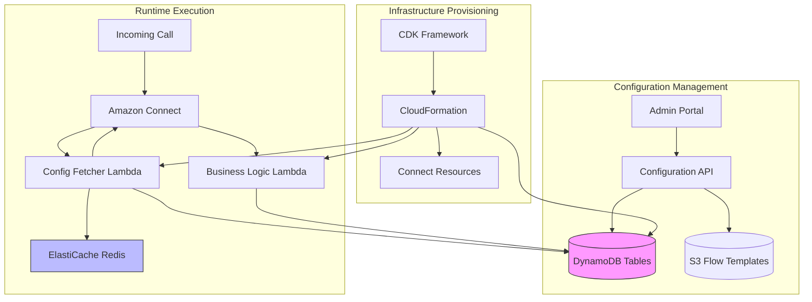

# 🔄 Dynamic Configuration Strategy

## Overview

This document outlines the strategy for making Amazon Connect configurations dynamic and manageable without requiring framework redeployment. The approach uses DynamoDB for configuration storage, Lambda functions for retrieval, and S3 for flow templates.

## Architecture Pattern: Configuration as Data

### Core Principle

**Separate infrastructure provisioning from business logic configuration**. The CDK framework provisions resources (queues, routing profiles, users) while DynamoDB stores the business logic configurations (which queue to use for which scenario, logging preferences, flow parameters).

## System Architecture



## DynamoDB Table Design

### 1. Inbound Flow Configuration Table

**Table Name**: `ConnectFlowConfigurations`
**Partition Key**: `flowId` (String)
**Sort Key**: `version` (Number)

```json
{
  "flowId": "inbound-sales-flow",
  "version": 3,
  "flowName": "Sales Inbound Flow",
  "active": true,
  "flowTemplate": "s3://connect-flows/templates/sales-inbound-v2.json",
  "parameters": {
    "welcomeMessage": "Thank you for calling our sales team",
    "businessHours": {
      "queueArn": "arn:aws:connect:...:queue/sales-queue",
      "waitMusicPrompt": "arn:aws:connect:...:prompt/hold-music"
    },
    "afterHours": {
      "queueArn": "arn:aws:connect:...:queue/voicemail-queue",
      "message": "We are currently closed"
    },
    "maxQueueTime": 300,
    "callbackEnabled": true,
    "lambdaFunctions": {
      "customerLookup": "arn:aws:lambda:...:function:customer-lookup",
      "disposition": "arn:aws:lambda:...:function:call-disposition"
    }
  },
  "logging": {
    "level": "INFO",
    "cloudWatchLogGroup": "/aws/connect/flows/sales-inbound",
    "enableContactLens": true,
    "s3RecordingBucket": "connect-recordings-prod"
  },
  "metadata": {
    "createdBy": "admin@company.com",
    "createdAt": "2024-10-24T10:00:00Z",
    "updatedAt": "2024-10-24T15:30:00Z",
    "description": "Updated queue timeout to 5 minutes"
  }
}
```

**Global Secondary Indexes**:
- `active-index`: Partition key: `active`, Sort key: `flowName`

### 2. Queue Configuration Table

**Table Name**: `ConnectQueueConfigurations`
**Partition Key**: `queueId` (String)

```json
{
  "queueId": "sales-queue",
  "queueArn": "arn:aws:connect:...:queue/sales-queue",
  "queueName": "Sales Team Queue",
  "configuration": {
    "maxContacts": 50,
    "defaultRoutingProfile": "arn:aws:connect:...:routing-profile/sales-profile",
    "hoursOfOperation": "arn:aws:connect:...:hours-of-operation/business-hours",
    "outboundCallerId": "+1234567890"
  },
  "routingRules": {
    "skillBasedRouting": true,
    "requiredSkills": ["sales", "product-knowledge"],
    "priorityRouting": {
      "vipCustomers": 1,
      "regularCustomers": 5
    }
  },
  "serviceLevelThresholds": {
    "targetAnswerTime": 20,
    "targetServiceLevel": 0.80
  },
  "whisperFlow": {
    "agentWhisperArn": "arn:aws:connect:...:contact-flow/agent-whisper",
    "customerWhisperArn": "arn:aws:connect:...:contact-flow/customer-whisper"
  },
  "monitoring": {
    "alertThresholds": {
      "queuedCallsWarning": 10,
      "queuedCallsCritical": 25,
      "longestWaitWarning": 180,
      "longestWaitCritical": 300
    },
    "snsTopicArn": "arn:aws:sns:...:queue-alerts"
  }
}
```

### 3. Routing Configuration Table

**Table Name**: `ConnectRoutingConfigurations`
**Partition Key**: `routingKey` (String)
**Sort Key**: `conditionId` (String)

```json
{
  "routingKey": "customer-type-routing",
  "conditionId": "vip-customer",
  "priority": 1,
  "conditions": {
    "attributeName": "CustomerSegment",
    "operator": "Equals",
    "value": "VIP"
  },
  "actions": {
    "targetQueue": "arn:aws:connect:...:queue/vip-queue",
    "routingProfile": "arn:aws:connect:...:routing-profile/vip-profile",
    "callbackQueue": "arn:aws:connect:...:queue/vip-callback",
    "additionalAttributes": {
      "priorityLevel": "HIGH",
      "slaMinutes": "5"
    }
  }
}
```

### 4. Logging Configuration Table

**Table Name**: `ConnectLoggingConfigurations`
**Partition Key**: `resourceType` (String)
**Sort Key**: `resourceId` (String)

```json
{
  "resourceType": "ContactFlow",
  "resourceId": "inbound-sales-flow",
  "loggingConfig": {
    "enabled": true,
    "level": "DEBUG",
    "destinations": {
      "cloudWatch": {
        "logGroupName": "/aws/connect/flows/sales",
        "retentionDays": 30
      },
      "s3": {
        "bucket": "connect-logs-archive",
        "prefix": "flows/sales/",
        "compressionFormat": "GZIP"
      },
      "kinesis": {
        "streamArn": "arn:aws:kinesis:...:stream/connect-events",
        "batchSize": 100
      }
    },
    "filterRules": {
      "excludePatterns": ["^DEBUG:Routine"],
      "includePII": false
    }
  },
  "contactLens": {
    "enabled": true,
    "realtimeAnalytics": true,
    "postCallAnalytics": true,
    "categories": ["CustomerComplaint", "PositiveSentiment"],
    "redaction": {
      "pii": ["SSN", "CreditCard", "Email"],
      "phi": true
    }
  },
  "retention": {
    "callRecordings": 90,
    "chatTranscripts": 90,
    "contactTraceRecords": 90
  }
}
```

### 5. Feature Flags Table

**Table Name**: `ConnectFeatureFlags`
**Partition Key**: `featureName` (String)
**Sort Key**: `environment` (String)

```json
{
  "featureName": "callback-queuing",
  "environment": "production",
  "enabled": true,
  "rolloutPercentage": 100,
  "targetSegments": ["all"],
  "configuration": {
    "maxCallbackDelayMinutes": 1440,
    "callbackWindowHours": 72,
    "enableSmsConfirmation": true
  },
  "lastModified": "2024-10-24T10:00:00Z",
  "modifiedBy": "admin@company.com"
}
```

## Lambda Functions Architecture

### Config Fetcher Lambda Pattern

```csharp
// ConfigFetcherFunction.cs
using Amazon.DynamoDBv2;
using Amazon.DynamoDBv2.DataModel;
using Amazon.Lambda.Core;
using System.Text.Json;
using StackExchange.Redis;

[assembly: LambdaSerializer(typeof(Amazon.Lambda.Serialization.SystemTextJson.DefaultLambdaJsonSerializer))]

public class ConfigFetcherFunction
{
    private readonly IAmazonDynamoDB _dynamoDb;
    private readonly DynamoDBContext _context;
    private readonly IConnectionMultiplexer _redis;
    private readonly string _tableName;

    public ConfigFetcherFunction()
    {
        _dynamoDb = new AmazonDynamoDBClient();
        _context = new DynamoDBContext(_dynamoDb);
        _tableName = Environment.GetEnvironmentVariable("CONFIG_TABLE_NAME");
        
        // Redis for caching (optional but recommended)
        var redisEndpoint = Environment.GetEnvironmentVariable("REDIS_ENDPOINT");
        if (!string.IsNullOrEmpty(redisEndpoint))
        {
            _redis = ConnectionMultiplexer.Connect(redisEndpoint);
        }
    }

    public async Task<ConfigResponse> FunctionHandler(ConfigRequest request, ILambdaContext context)
    {
        try
        {
            context.Logger.LogInformation($"Fetching config for flow: {request.FlowId}");

            // Try cache first
            var cached = await GetFromCache(request.FlowId);
            if (cached != null)
            {
                context.Logger.LogInformation("Config retrieved from cache");
                return cached;
            }

            // Fetch from DynamoDB
            var config = await GetFlowConfiguration(request.FlowId);
            
            if (config == null)
            {
                throw new ConfigNotFoundException($"Configuration not found for flow: {request.FlowId}");
            }

            if (!config.Active)
            {
                throw new ConfigDisabledException($"Configuration is disabled for flow: {request.FlowId}");
            }

            // Enrich with related configurations
            config = await EnrichConfiguration(config, request);

            // Cache for next request
            await CacheConfiguration(request.FlowId, config);

            return new ConfigResponse
            {
                Success = true,
                Configuration = config,
                CacheHit = false
            };
        }
        catch (Exception ex)
        {
            context.Logger.LogError($"Error fetching configuration: {ex.Message}");
            return new ConfigResponse
            {
                Success = false,
                ErrorMessage = ex.Message
            };
        }
    }

    private async Task<FlowConfiguration?> GetFlowConfiguration(string flowId)
    {
        var config = new DynamoDBOperationConfig
        {
            OverrideTableName = _tableName,
            QueryFilter = new List<ScanCondition>
            {
                new ScanCondition("active", ScanOperator.Equal, true)
            }
        };

        var results = await _context.QueryAsync<FlowConfiguration>(
            flowId,
            config
        ).GetRemainingAsync();

        return results
            .OrderByDescending(r => r.Version)
            .FirstOrDefault();
    }

    private async Task<FlowConfiguration> EnrichConfiguration(
        FlowConfiguration config, 
        ConfigRequest request)
    {
        // Fetch related queue configurations
        if (config.Parameters.ContainsKey("queueArn"))
        {
            var queueConfig = await GetQueueConfiguration(config.Parameters["queueArn"].ToString());
            config.EnrichedData["queueConfig"] = queueConfig;
        }

        // Fetch routing rules
        if (request.IncludeRoutingRules)
        {
            var routingRules = await GetRoutingRules(config.FlowId);
            config.EnrichedData["routingRules"] = routingRules;
        }

        // Fetch feature flags
        var features = await GetFeatureFlags(request.Environment);
        config.EnrichedData["features"] = features;

        return config;
    }

    private async Task<ConfigResponse?> GetFromCache(string flowId)
    {
        if (_redis == null) return null;

        try
        {
            var db = _redis.GetDatabase();
            var cached = await db.StringGetAsync($"config:{flowId}");
            
            if (cached.HasValue)
            {
                return JsonSerializer.Deserialize<ConfigResponse>(cached.ToString());
            }
        }
        catch (Exception ex)
        {
            // Log but don't fail on cache errors
            Console.WriteLine($"Cache retrieval error: {ex.Message}");
        }

        return null;
    }

    private async Task CacheConfiguration(string flowId, FlowConfiguration config)
    {
        if (_redis == null) return;

        try
        {
            var db = _redis.GetDatabase();
            var serialized = JsonSerializer.Serialize(config);
            await db.StringSetAsync(
                $"config:{flowId}", 
                serialized, 
                TimeSpan.FromMinutes(5) // 5-minute TTL
            );
        }
        catch (Exception ex)
        {
            Console.WriteLine($"Cache write error: {ex.Message}");
        }
    }
}

// Data models
public class ConfigRequest
{
    public string FlowId { get; set; }
    public string Environment { get; set; }
    public bool IncludeRoutingRules { get; set; }
    public Dictionary<string, string> ContactAttributes { get; set; }
}

public class ConfigResponse
{
    public bool Success { get; set; }
    public FlowConfiguration Configuration { get; set; }
    public bool CacheHit { get; set; }
    public string ErrorMessage { get; set; }
}

[DynamoDBTable("ConnectFlowConfigurations")]
public class FlowConfiguration
{
    [DynamoDBHashKey]
    public string FlowId { get; set; }
    
    [DynamoDBRangeKey]
    public int Version { get; set; }
    
    public string FlowName { get; set; }
    public bool Active { get; set; }
    public string FlowTemplate { get; set; }
    public Dictionary<string, object> Parameters { get; set; }
    public LoggingConfiguration Logging { get; set; }
    public Dictionary<string, object> EnrichedData { get; set; } = new();
}
```

### Flow Template with Parameter Substitution

Store flow JSON templates in S3 with placeholder tokens:

```json
{
  "Version": "2019-10-30",
  "StartAction": "welcome-message",
  "Actions": [
    {
      "Identifier": "welcome-message",
      "Type": "MessageParticipant",
      "Parameters": {
        "Text": "{{welcomeMessage}}"
      },
      "Transitions": {
        "NextAction": "check-business-hours"
      }
    },
    {
      "Identifier": "check-business-hours",
      "Type": "CheckHoursOfOperation",
      "Parameters": {
        "HoursOfOperationArn": "{{hoursOfOperationArn}}"
      },
      "Transitions": {
        "Conditions": [
          {
            "Condition": "CheckInHours",
            "NextAction": "transfer-to-queue"
          },
          {
            "Condition": "CheckOutOfHours",
            "NextAction": "after-hours-message"
          }
        ]
      }
    },
    {
      "Identifier": "transfer-to-queue",
      "Type": "TransferContactToQueue",
      "Parameters": {
        "QueueArn": "{{businessHours.queueArn}}",
        "WaitMusicPrompt": "{{businessHours.waitMusicPrompt}}"
      }
    }
  ]
}
```

Lambda function to hydrate template:

```csharp
public class FlowTemplateHydrator
{
    private readonly IAmazonS3 _s3Client;

    public async Task<string> HydrateFlowTemplate(
        FlowConfiguration config, 
        Dictionary<string, string> runtimeParams)
    {
        // Download template from S3
        var templateKey = config.FlowTemplate.Replace("s3://connect-flows/", "");
        var response = await _s3Client.GetObjectAsync("connect-flows", templateKey);
        
        string template;
        using (var reader = new StreamReader(response.ResponseStream))
        {
            template = await reader.ReadToEndAsync();
        }

        // Substitute parameters
        template = SubstituteParameters(template, config.Parameters);
        template = SubstituteParameters(template, runtimeParams);

        // Validate JSON structure
        ValidateFlowJson(template);

        return template;
    }

    private string SubstituteParameters(string template, Dictionary<string, object> parameters)
    {
        foreach (var param in parameters)
        {
            var token = $"{{{{{param.Key}}}}}";
            
            if (param.Value is string strValue)
            {
                template = template.Replace(token, strValue);
            }
            else if (param.Value is JsonElement jsonValue)
            {
                // Handle nested objects like businessHours.queueArn
                template = SubstituteNestedParameters(template, param.Key, jsonValue);
            }
        }

        return template;
    }

    private string SubstituteNestedParameters(string template, string prefix, JsonElement value)
    {
        if (value.ValueKind == JsonValueKind.Object)
        {
            foreach (var property in value.EnumerateObject())
            {
                var token = $"{{{{{prefix}.{property.Name}}}}}";
                var propertyValue = property.Value.ToString();
                template = template.Replace(token, propertyValue);
            }
        }

        return template;
    }
}
```

## CDK Framework Integration

### Configuration Bootstrap Stack

```csharp
public class ConfigurationStack : Stack
{
    public Table FlowConfigTable { get; }
    public Table QueueConfigTable { get; }
    public Table RoutingConfigTable { get; }
    public Table LoggingConfigTable { get; }
    public Table FeatureFlagsTable { get; }

    public ConfigurationStack(Construct scope, string id, IStackProps props = null) 
        : base(scope, id, props)
    {
        // Flow Configuration Table
        FlowConfigTable = new Table(this, "FlowConfigTable", new TableProps
        {
            TableName = "ConnectFlowConfigurations",
            PartitionKey = new Attribute { Name = "flowId", Type = AttributeType.STRING },
            SortKey = new Attribute { Name = "version", Type = AttributeType.NUMBER },
            BillingMode = BillingMode.PAY_PER_REQUEST,
            PointInTimeRecovery = true,
            Stream = StreamViewType.NEW_AND_OLD_IMAGES
        });

        FlowConfigTable.AddGlobalSecondaryIndex(new GlobalSecondaryIndexProps
        {
            IndexName = "active-index",
            PartitionKey = new Attribute { Name = "active", Type = AttributeType.NUMBER },
            SortKey = new Attribute { Name = "flowName", Type = AttributeType.STRING },
            ProjectionType = ProjectionType.ALL
        });

        // Queue Configuration Table
        QueueConfigTable = new Table(this, "QueueConfigTable", new TableProps
        {
            TableName = "ConnectQueueConfigurations",
            PartitionKey = new Attribute { Name = "queueId", Type = AttributeType.STRING },
            BillingMode = BillingMode.PAY_PER_REQUEST,
            PointInTimeRecovery = true
        });

        // Routing Configuration Table
        RoutingConfigTable = new Table(this, "RoutingConfigTable", new TableProps
        {
            TableName = "ConnectRoutingConfigurations",
            PartitionKey = new Attribute { Name = "routingKey", Type = AttributeType.STRING },
            SortKey = new Attribute { Name = "conditionId", Type = AttributeType.STRING },
            BillingMode = BillingMode.PAY_PER_REQUEST
        });

        // Logging Configuration Table
        LoggingConfigTable = new Table(this, "LoggingConfigTable", new TableProps
        {
            TableName = "ConnectLoggingConfigurations",
            PartitionKey = new Attribute { Name = "resourceType", Type = AttributeType.STRING },
            SortKey = new Attribute { Name = "resourceId", Type = AttributeType.STRING },
            BillingMode = BillingMode.PAY_PER_REQUEST
        });

        // Feature Flags Table
        FeatureFlagsTable = new Table(this, "FeatureFlagsTable", new TableProps
        {
            TableName = "ConnectFeatureFlags",
            PartitionKey = new Attribute { Name = "featureName", Type = AttributeType.STRING },
            SortKey = new Attribute { Name = "environment", Type = AttributeType.STRING },
            BillingMode = BillingMode.PAY_PER_REQUEST
        });

        // DynamoDB Stream processing for audit/notifications
        var streamProcessor = new Function(this, "ConfigChangeProcessor", new FunctionProps
        {
            Runtime = Runtime.DOTNET_8,
            Handler = "ConfigProcessor::ConfigProcessor.Function::FunctionHandler",
            Code = Code.FromAsset("./lambda/ConfigProcessor/bin/Release/net8.0/publish"),
            Environment = new Dictionary<string, string>
            {
                { "SNS_TOPIC_ARN", "arn:aws:sns:..." }
            }
        });

        FlowConfigTable.GrantStreamRead(streamProcessor);
        
        streamProcessor.AddEventSource(new DynamoEventSource(FlowConfigTable, new DynamoEventSourceProps
        {
            StartingPosition = StartingPosition.LATEST,
            BatchSize = 10,
            RetryAttempts = 3
        }));

        // Output ARNs for other stacks
        new CfnOutput(this, "FlowConfigTableArn", new CfnOutputProps
        {
            Value = FlowConfigTable.TableArn,
            ExportName = "ConnectFlowConfigTableArn"
        });
    }
}
```

### Config-Aware Connect Stack

```csharp
public class ConfigAwareConnectStack : Stack
{
    public ConfigAwareConnectStack(Construct scope, string id, ConfigAwareProps props) 
        : base(scope, id, props)
    {
        // Reference configuration tables
        var flowConfigTable = Table.FromTableArn(this, "FlowConfigTable", 
            Fn.ImportValue("ConnectFlowConfigTableArn"));

        // Create Config Fetcher Lambda
        var configFetcher = new Function(this, "ConfigFetcher", new FunctionProps
        {
            Runtime = Runtime.DOTNET_8,
            Handler = "ConfigFetcher::ConfigFetcher.Function::FunctionHandler",
            Code = Code.FromAsset("./lambda/ConfigFetcher/bin/Release/net8.0/publish"),
            Timeout = Duration.Seconds(10),
            MemorySize = 512,
            Environment = new Dictionary<string, string>
            {
                { "CONFIG_TABLE_NAME", flowConfigTable.TableName },
                { "REDIS_ENDPOINT", props.RedisEndpoint }
            },
            ReservedConcurrentExecutions = 10 // Control concurrent Lambda invocations
        });

        flowConfigTable.GrantReadData(configFetcher);

        // Grant Lambda invoke permission to Connect
        configFetcher.GrantInvoke(new ServicePrincipal("connect.amazonaws.com"));

        // Create Connect Instance
        var instance = new CfnInstance(this, "ConnectInstance", new CfnInstanceProps
        {
            Attributes = new CfnInstance.AttributesProperty
            {
                InboundCalls = true,
                OutboundCalls = true,
                ContactflowLogs = true
            },
            IdentityManagementType = "CONNECT_MANAGED",
            InstanceAlias = props.InstanceAlias
        });

        // Associate Lambda with Connect instance
        new CfnIntegrationAssociation(this, "ConfigFetcherIntegration", 
            new CfnIntegrationAssociationProps
            {
                InstanceId = instance.Ref,
                IntegrationType = "LAMBDA_FUNCTION",
                IntegrationArn = configFetcher.FunctionArn
            });

        // Create dynamic contact flow that fetches config
        var flowJson = CreateDynamicFlowJson(configFetcher.FunctionArn);
        
        new CfnContactFlow(this, "DynamicInboundFlow", new CfnContactFlowProps
        {
            InstanceArn = instance.AttrArn,
            Name = "Dynamic Inbound Flow",
            Type = "CONTACT_FLOW",
            Content = flowJson
        });
    }

    private string CreateDynamicFlowJson(string configFetcherArn)
    {
        var flow = new
        {
            Version = "2019-10-30",
            StartAction = "fetch-config",
            Actions = new object[]
            {
                new
                {
                    Identifier = "fetch-config",
                    Type = "InvokeLambdaFunction",
                    Parameters = new
                    {
                        LambdaFunctionARN = configFetcherArn,
                        InvocationTimeLimitSeconds = "8",
                        ResponseValidation = new
                        {
                            ResponseType = "JSON"
                        }
                    },
                    Transitions = new
                    {
                        NextAction = "check-config-success",
                        Errors = new[]
                        {
                            new
                            {
                                ErrorType = "NoMatchingError",
                                NextAction = "error-handler"
                            }
                        }
                    }
                },
                new
                {
                    Identifier = "check-config-success",
                    Type = "Compare",
                    Parameters = new
                    {
                        ComparisonValue = "true"
                    },
                    Transitions = new
                    {
                        Conditions = new[]
                        {
                            new
                            {
                                Condition = "Evaluate",
                                ConditionType = "Equals",
                                ConditionValue = "$.External.success",
                                NextAction = "route-based-on-config"
                            }
                        },
                        NextAction = "error-handler"
                    }
                },
                new
                {
                    Identifier = "route-based-on-config",
                    Type = "TransferContactToQueue",
                    Parameters = new
                    {
                        QueueArn = "$.External.configuration.parameters.businessHours.queueArn"
                    },
                    Transitions = new { }
                },
                new
                {
                    Identifier = "error-handler",
                    Type = "MessageParticipant",
                    Parameters = new
                    {
                        Text = "We're experiencing technical difficulties. Please try again later."
                    },
                    Transitions = new
                    {
                        NextAction = "disconnect"
                    }
                },
                new
                {
                    Identifier = "disconnect",
                    Type = "DisconnectParticipant",
                    Parameters = new { }
                }
            }
        };

        return JsonSerializer.Serialize(flow, new JsonSerializerOptions
        {
            WriteIndented = true
        });
    }
}
```

## Benefits of This Approach

### 1. Zero-Downtime Configuration Changes
- Update DynamoDB records without redeploying infrastructure
- Changes take effect immediately (cache TTL)
- Rollback by reverting DynamoDB record

### 2. Environment-Specific Configuration
- Same infrastructure code across environments
- Different configurations per environment in DynamoDB
- Feature flags for gradual rollouts

### 3. Audit Trail and Versioning
- DynamoDB Streams capture all changes
- Version number in sort key enables rollback
- Metadata tracks who changed what when

### 4. Separation of Concerns
- Infrastructure team manages CDK code
- Business/operations team manages configurations
- Clear boundaries and responsibilities

### 5. Testing and Validation
- Test configuration changes in isolation
- A/B test different configurations
- Gradual rollout with feature flags

## Implementation Checklist

- [ ] Create DynamoDB table definitions in CDK
- [ ] Implement Lambda function for config fetching
- [ ] Add Redis/ElastiCache for caching layer
- [ ] Create S3 bucket for flow templates
- [ ] Build parameter substitution engine
- [ ] Implement DynamoDB Streams processor for audit
- [ ] Create admin portal/API for config management
- [ ] Add monitoring and alerting for config changes
- [ ] Write comprehensive tests for Lambda functions
- [ ] Document configuration schema and examples
- [ ] Set up IAM roles and permissions
- [ ] Implement config validation on write

## Security Considerations

1. **Encryption**: Enable encryption at rest for DynamoDB tables
2. **IAM Policies**: Least privilege access for Lambda functions
3. **VPC**: Run Lambda functions in VPC with private subnets
4. **Secrets**: Store sensitive values in AWS Secrets Manager, reference ARN in config
5. **Validation**: Validate all configuration changes before applying
6. **Audit**: Log all configuration reads and writes to CloudTrail

## Performance Optimization

1. **Caching**: Use Redis/ElastiCache with 5-minute TTL
2. **Batch Reads**: Fetch multiple configurations in single DynamoDB query
3. **Reserved Concurrency**: Limit Lambda concurrent executions to avoid throttling
4. **Connection Pooling**: Reuse DynamoDB and Redis connections
5. **Lazy Loading**: Only fetch enriched data when needed
