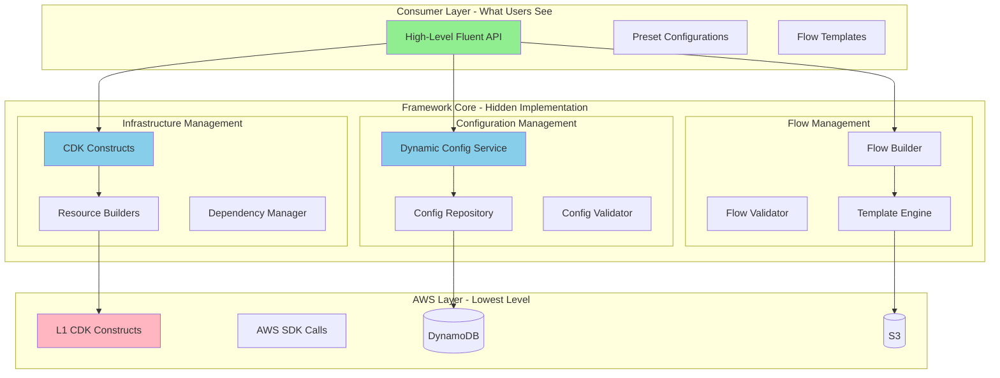
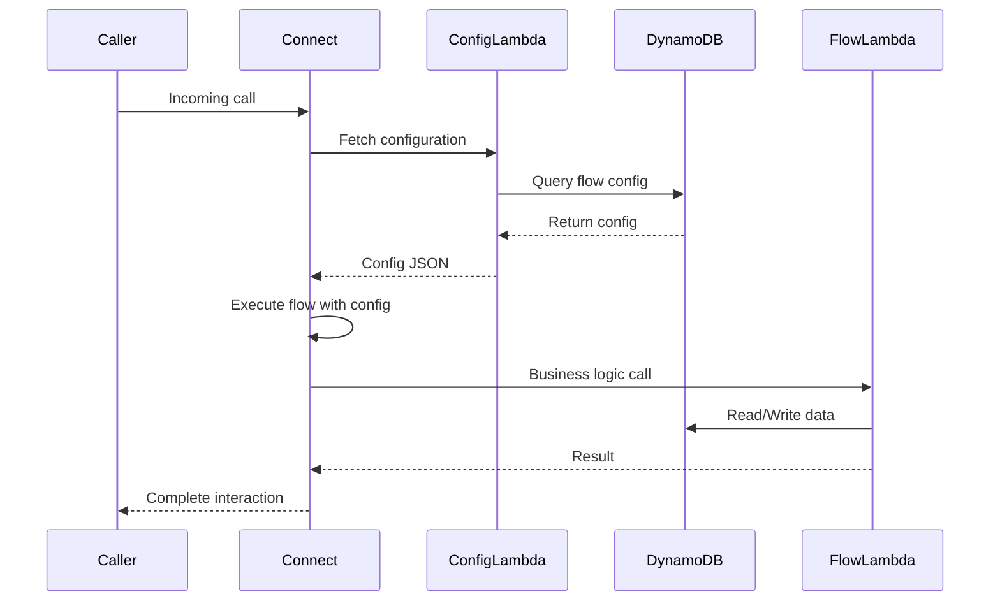
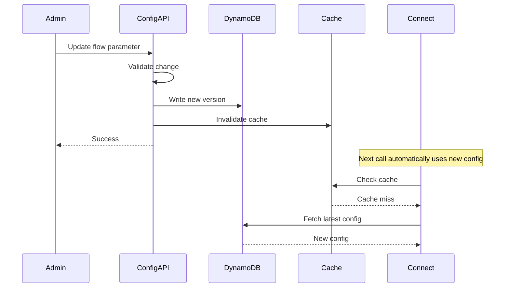

# 🏗️ Framework Architecture: Unified vs Split

## The Central Question

**Should the framework be split into two separate concerns, or unified with high-level abstractions hiding implementation details?**

## Answer: **Unified Framework with Clear Layered Architecture**

The framework should be **unified** but with **clear separation of concerns** through layered architecture. This provides the best of both worlds.

## Architecture Overview



## Why Unified?

### 1. Single Deployment Pipeline
```csharp
// User deploys everything together
var app = new App();

// Single CDK app encompasses everything
var connectApp = new ConnectApplicationStack(app, "MyConnect", new ConnectAppProps
{
    InstanceName = "MyContactCenter",
    Environment = "production"
});

// High-level API hides complexity
connectApp
    .AddQueue("Sales", config =>
    {
        config.MaxContacts = 50;
        config.ServiceLevel = 0.80;
        config.RoutingStrategy = RoutingStrategy.SkillBased;
    })
    .AddFlow("SalesInbound", flow =>
    {
        flow.WelcomeMessage = "Thank you for calling sales";
        flow.QueueTransfer("Sales");
        flow.EnableCallback();
    })
    .AddDynamicConfiguration(dynConfig =>
    {
        dynConfig.EnableRuntimeUpdates = true;
        dynConfig.CacheTTL = TimeSpan.FromMinutes(5);
    });

app.Synth();

// One command deploys everything:
// - DynamoDB tables for config
// - Lambda functions
// - Connect resources
// - S3 buckets
// - All wired together
```

### 2. Consistent Versioning
All components version together, avoiding compatibility nightmares:
```
v1.0.0: CDK constructs + Lambda v1.0 + Config schema v1.0
v1.1.0: Added feature X across all layers
v2.0.0: Breaking changes coordinated across stack
```

### 3. Shared Code and Models
```csharp
// Shared models used everywhere
namespace MyCompany.Connect.Core.Models;

// Used by CDK constructs
// Used by Lambda functions
// Used by configuration API
public class FlowConfiguration
{
    public string FlowId { get; set; }
    public Dictionary<string, object> Parameters { get; set; }
    public RoutingRules Routing { get; set; }
}

// Single NuGet package: MyCompany.Connect.Framework
// Contains: CDK constructs, Lambda handlers, shared models
```

### 4. Integrated Testing
```csharp
[TestClass]
public class IntegrationTests
{
    [TestMethod]
    public async Task TestCompleteFlow()
    {
        // Test infrastructure creation
        var app = new App();
        var stack = new ConnectStack(app, "test");
        var template = Template.FromStack(stack);
        
        template.ResourceCountIs("AWS::Connect::ContactFlow", 1);
        template.ResourceCountIs("AWS::DynamoDB::Table", 1);
        
        // Test Lambda configuration fetch
        var configFetcher = new ConfigFetcher.Function();
        var response = await configFetcher.FunctionHandler(
            new ConfigRequest { FlowId = "test" },
            mockContext
        );
        
        Assert.IsTrue(response.Success);
        
        // Test flow generation
        var flowJson = stack.GeneratedFlow.ToJson();
        Assert.IsTrue(flowJson.Contains("TransferContactToQueue"));
    }
}
```

## Layered Architecture Details

### Layer 1: High-Level Consumer API

**What users interact with - simple and opinionated.**

```csharp
// Super simple for common use cases
public class SimpleExample
{
    public void CreateBasicCallCenter()
    {
        var app = new App();
        
        // One line creates entire contact center
        var connect = ConnectApp.CreateStandard(app, "MyCallCenter", options =>
        {
            options.Region = "us-east-1";
            options.Queues = new[] { "Sales", "Support", "Billing" };
            options.BusinessHours = BusinessHours.Default;
            options.EnableDynamicConfiguration = true;
        });

        app.Synth();
    }
}

// Complex scenarios still possible
public class AdvancedExample
{
    public void CreateCustomCallCenter()
    {
        var app = new App();
        var connect = new ConnectApplicationStack(app, "Advanced");

        // Granular control when needed
        var salesQueue = connect.AddQueue("Sales", new QueueConfiguration
        {
            MaxContacts = 100,
            HoursOfOperation = connect.CreateHoursOfOperation("24/7", HoursTemplate.AlwaysOpen)
        });

        var supportQueue = connect.AddQueue("Support", new QueueConfiguration
        {
            MaxContacts = 50,
            RoutingProfile = connect.CreateRoutingProfile("SupportProfile", profile =>
            {
                profile.AddQueueReference(salesQueue, priority: 2, delay: 0);
            })
        });

        // Fine-grained flow control
        connect.AddFlow("Inbound", flow =>
        {
            flow.StartWith(ActionType.MessageParticipant)
                .SetText("Welcome")
                .Then()
                .GetInput(input =>
                {
                    input.SetText("Press 1 for Sales, 2 for Support");
                    input.OnDigit("1", () => flow.TransferToQueue(salesQueue));
                    input.OnDigit("2", () => flow.TransferToQueue(supportQueue));
                })
                .Build();
        });

        app.Synth();
    }
}
```

### Layer 2: Framework Core (Hidden from Users)

**Implementation details - users don't need to know this exists.**

```csharp
// Internal implementation
namespace MyCompany.Connect.Framework.Core;

internal class ConnectApplicationStack : Stack
{
    private readonly List<CfnQueue> _queues;
    private readonly ConfigurationManager _configManager;
    private readonly FlowGenerator _flowGenerator;
    private readonly ResourceOrchestrator _orchestrator;

    internal ConnectApplicationStack(Construct scope, string id) : base(scope, id)
    {
        // Bootstrap infrastructure
        _configManager = new ConfigurationManager(this);
        _flowGenerator = new FlowGenerator(this);
        _orchestrator = new ResourceOrchestrator(this);

        // Create configuration tables
        _configManager.CreateTables();

        // Create Lambda functions
        _configManager.DeployFunctions();
    }

    public IQueue AddQueue(string name, Action<QueueConfiguration> configure)
    {
        var config = new QueueConfiguration();
        configure(config);

        // Orchestrator handles dependencies
        var queue = _orchestrator.CreateQueue(name, config);

        // Store configuration in DynamoDB
        _configManager.StoreQueueConfig(name, config);

        return queue;
    }

    public IContactFlow AddFlow(string name, Action<FlowBuilder> configure)
    {
        var builder = new FlowBuilder(name);
        configure(builder);

        // Generate flow JSON
        var flowJson = builder.Build().ToJson();

        // Create CDK resource
        var cfnFlow = new CfnContactFlow(this, name, new CfnContactFlowProps
        {
            InstanceArn = _orchestrator.InstanceArn,
            Name = name,
            Type = "CONTACT_FLOW",
            Content = flowJson
        });

        // Store template in S3 for dynamic updates
        _configManager.StoreFlowTemplate(name, flowJson);

        return new ContactFlowWrapper(cfnFlow);
    }
}
```

### Layer 3: AWS Infrastructure (Lowest Level)

**Direct AWS interaction - framework manages this.**

```csharp
// Users never see this unless they explicitly go low-level
namespace MyCompany.Connect.Framework.Infrastructure;

internal class ResourceOrchestrator
{
    private readonly Stack _stack;
    private readonly CfnInstance _instance;
    private readonly Dictionary<string, CfnQueue> _queueCache;

    public IQueue CreateQueue(string name, QueueConfiguration config)
    {
        // Create hours of operation if needed
        var hours = EnsureHoursOfOperation(config.HoursOfOperation);

        // Create queue with L1 construct
        var queue = new CfnQueue(_stack, $"Queue-{name}", new CfnQueueProps
        {
            InstanceArn = _instance.AttrArn,
            Name = name,
            HoursOfOperationArn = hours.AttrHoursOfOperationArn,
            MaxContacts = config.MaxContacts
        });

        // Track dependencies
        queue.AddDependency(hours);

        // Cache for reuse
        _queueCache[name] = queue;

        return new QueueWrapper(queue);
    }

    private CfnHoursOfOperation EnsureHoursOfOperation(HoursTemplate template)
    {
        // Implementation details hidden from user
    }
}
```

## Configuration vs Infrastructure Separation

### Both Managed Together, Clear Boundaries

```csharp
// Configuration concerns
namespace MyCompany.Connect.Framework.Configuration
{
    public interface IConfigurationManager
    {
        Task StoreConfigurationAsync(string key, object value);
        Task<T> GetConfigurationAsync<T>(string key);
        Task UpdateFlowParametersAsync(string flowId, Dictionary<string, object> parameters);
    }

    internal class DynamoDbConfigurationManager : IConfigurationManager
    {
        // DynamoDB operations
    }
}

// Infrastructure concerns
namespace MyCompany.Connect.Framework.Infrastructure
{
    public interface IResourceProvisioner
    {
        IQueue ProvisionQueue(QueueConfiguration config);
        IContactFlow ProvisionFlow(FlowConfiguration config);
        IRoutingProfile ProvisionRoutingProfile(RoutingConfiguration config);
    }

    internal class CdkResourceProvisioner : IResourceProvisioner
    {
        // CDK L1 construct operations
    }
}

// Orchestration layer ties them together
namespace MyCompany.Connect.Framework.Core
{
    internal class FrameworkOrchestrator
    {
        private readonly IConfigurationManager _configManager;
        private readonly IResourceProvisioner _provisioner;

        public void Deploy(ConnectApplicationDefinition definition)
        {
            // 1. Provision infrastructure
            var queue = _provisioner.ProvisionQueue(definition.QueueConfig);

            // 2. Store runtime configuration
            _configManager.StoreConfiguration(
                $"queue:{queue.Name}", 
                definition.RuntimeConfig
            );

            // 3. Wire them together
            AttachConfiguration(queue, definition.RuntimeConfig);
        }
    }
}
```

## Benefits of Unified Approach

### For Simple Use Cases
```csharp
// User writes 10 lines
var app = new App();
ConnectApp.CreateStandard(app, "CallCenter", options =>
{
    options.Queues = new[] { "Sales", "Support" };
    options.EnableDynamicConfiguration = true;
});
app.Synth();

// Framework does 1000 things behind the scenes:
// - Creates DynamoDB tables
// - Deploys Lambda functions
// - Provisions Connect resources
// - Configures IAM roles
// - Sets up S3 buckets
// - Wires everything together
// - All correctly, securely, following best practices
```

### For Complex Use Cases
```csharp
// User can access lower levels when needed
var app = new App();
var stack = new Stack(app, "custom");

// Use low-level L1 constructs directly
var queue = new CfnQueue(stack, "MyQueue", new CfnQueueProps
{
    InstanceArn = "...",
    Name = "Special Queue"
});

// Or mix high and low level
var connect = new ConnectApplicationStack(app, "mixed");
connect.AddQueue("StandardQueue"); // High-level

var customQueue = new CfnQueue(stack, "CustomQueue", ...); // Low-level
connect.RegisterExternalQueue(customQueue); // Bridge

app.Synth();
```

## Package Structure

### Single NuGet Package
```
MyCompany.Connect.Framework (v1.0.0)
├── Core/
│   ├── ConnectApplicationStack.cs
│   ├── ConnectApp.cs (static helpers)
│   └── FrameworkOrchestrator.cs
├── Configuration/
│   ├── IConfigurationManager.cs
│   ├── DynamoDbConfigurationManager.cs
│   └── Models/
├── Infrastructure/
│   ├── IResourceProvisioner.cs
│   ├── CdkResourceProvisioner.cs
│   ├── Constructs/ (L2 wrappers)
│   └── Models/
├── Flows/
│   ├── FlowBuilder.cs
│   ├── FlowGenerator.cs
│   └── Templates/
├── Lambda/
│   ├── ConfigFetcher/
│   └── FlowExecutor/
└── Models/
    └── Shared models across all layers
```

### Clear Namespace Organization
```csharp
// Public API - what users import
using MyCompany.Connect.Framework;

// Users never import these (internal)
using MyCompany.Connect.Framework.Core;
using MyCompany.Connect.Framework.Configuration;
using MyCompany.Connect.Framework.Infrastructure;
```

## Deployment Flow

### Single Command
```bash
# User runs one command
cdk deploy MyContactCenter

# Framework orchestrates:
# 1. Create configuration infrastructure
#    - DynamoDB tables
#    - S3 buckets
#    - Lambda layers
#
# 2. Deploy Lambda functions
#    - Config fetcher
#    - Business logic handlers
#    - Stream processors
#
# 3. Provision Connect resources
#    - Instance
#    - Queues
#    - Routing profiles
#    - Contact flows
#
# 4. Wire everything together
#    - Lambda integrations
#    - IAM policies
#    - Flow references
#
# 5. Initialize configuration
#    - Seed DynamoDB tables
#    - Upload flow templates to S3
#    - Set default values
```

## Runtime Behavior

### How They Work Together



### Update Scenario



## When to Split (Not Recommended)

You might consider splitting if:

1. **Separate teams manage each concern**
   - Infrastructure team vs. Configuration team
   - But: Coordination overhead often worse than unified

2. **Very different deployment cadences**
   - Infrastructure: Monthly
   - Configuration: Hourly
   - But: Unified framework still supports this (DynamoDB updates don't redeploy infra)

3. **Separate governance/approval processes**
   - Infrastructure changes require security review
   - Configuration changes more flexible
   - But: Can model this with IAM policies in unified framework

**Even in these cases, unified framework with clear boundaries is usually better than actual split packages.**

## Final Recommendation

✅ **Build unified framework with:**
- High-level abstractions for easy consumption
- Clear internal layer separation
- Ability to access low-level when needed
- Single deployment pipeline
- Single versioning
- Integrated testing

❌ **Don't split into separate packages**
- Adds coordination overhead
- Version compatibility nightmares
- Duplicated code
- Harder to test end-to-end

**The unified approach with proper layering gives you all the benefits of separation without the drawbacks of actually splitting.**
